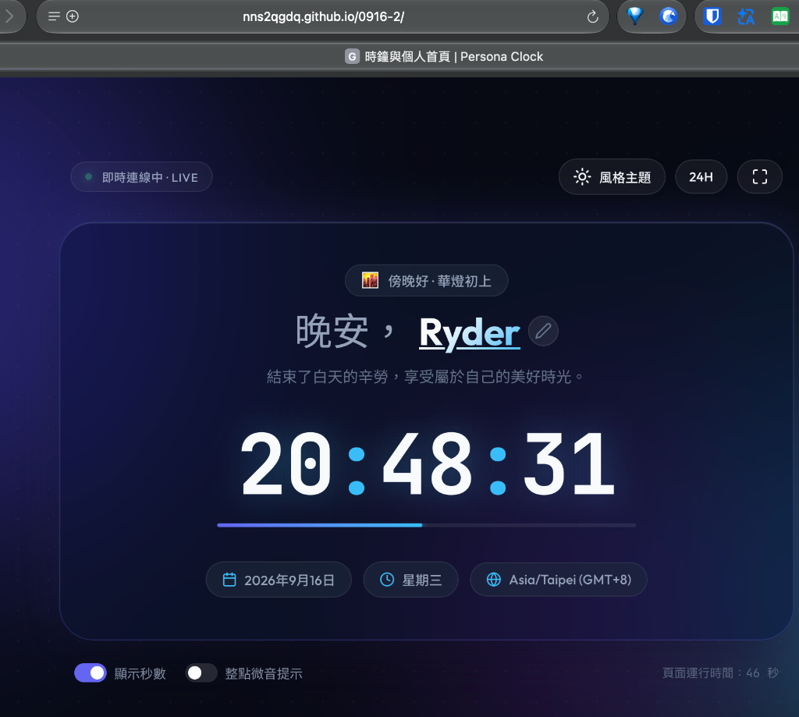

# ⏱️ Persona Clock (時鐘與個人儀表板)

> 一個兼具**極致視覺美感**與**高度互動性**的個人化即時時鐘首頁。採用現代**磨砂玻璃質感（Glassmorphism）**、流暢微動畫與多款風格主題設計，支援自訂個人名稱、時段動態問候、12/24小時制切換與全螢幕專注時鐘。

🔗 **線上展示網址 (Live Demo)**：[https://nns2qgdq.github.io/0916-2/](https://nns2qgdq.github.io/0916-2/)

---

## 📸 畫面預覽 (Preview)



---

## ✨ 核心特色

- **👤 個人化識別與在線編輯**：
  - 首頁顯眼展示您的名字（預設為 `Ryder`）。
  - 支援直接點擊名字或點選筆型圖示進行在線編輯，修改後自動儲存至瀏覽器 `localStorage`，重新整理也不會遺失。
- **🌤️ 時段動態智慧問候**：
  - 根據當前時刻自動切換問候語與圖示（清晨、上午黃金時段、午後小憩、專注衝刺、傍晚放鬆、深夜舒眠）。
- **🕒 高精度數位動態時鐘**：
  - 基於毫秒級同步行進，數字微光呼吸特效，冒號優雅跳動。
  - **秒數進度條**：每分鐘 0 至 60 秒的流暢漸層推進指示條。
  - 支援一鍵開關秒數顯示。
  - 支援一鍵切換 **24 小時制** 與 **12 小時制 (AM/PM)**。
- **🎨 4 款精緻主題切換**：
  - 🌌 **極光星夜 (Aurora)**：深邃星空與藍紫極光流動。
  - ⚡ **霓虹龐克 (Cyberpunk)**：電馭黑底搭配鮮亮青綠與高彩洋紅。
  - 🌇 **暖陽餘暉 (Sunset)**：溫暖夕陽橘橙與暮色微醺。
  - 🪞 **極簡磨砂 (Minimal)**：現代冷調石板灰與純粹毛玻璃。
- **🖥️ 全螢幕專注時鐘 (Focus Mode)**：
  - 支援一鍵進入全螢幕，非常適合放在副螢幕、平板或工作桌面作為專注輔助時鐘。
- **🔔 整點微音提示**：
  - 使用純前端原生 **Web Audio API** 即時合成溫和的三和弦提示音，無需下載額外音效檔案。
- **📅 日期與時區標籤**：
  - 自動偵測系統時區與 GMT 偏差（如 `Asia/Taipei (GMT+8)`），並完整呈現農曆/西元日期與星期。

---

## 🛠️ 技術架構

本專案採用無框架純原生技術打造，兼具極致效能與高度自訂彈性：

| 領域 | 技術與工具 | 說明 |
| :--- | :--- | :--- |
| **標記語言** | HTML5 | 語意化標籤、SEO 與無障礙屬性優化 |
| **樣式設計** | Vanilla CSS3 | CSS 變數設計系統、毛玻璃濾鏡 (`backdrop-filter`)、Flex/Grid 響應式排版 |
| **腳本邏輯** | Modern JavaScript (ES6+) | 狀態管理、`localStorage` 持久化、Web Audio API 合成音效、`requestAnimationFrame` |
| **排版字型** | Google Fonts | `Outfit` (標題顯示)、`JetBrains Mono` (等寬數字防抖動)、`Noto Sans TC` |

---

## 📂 專案結構

```bash
L2Web/
├── assets/
│   └── preview.png  # 專案實例執行畫面快照
├── index.html       # 網頁結構、儀表板主卡片、頂部工具列與語意化排版
├── style.css        # 主題色彩變數、磨砂卡片陰影、背景光球漂浮動畫、響應式斷點
├── app.js           # 時間引擎、名稱編輯表單、主題切換邏輯、音效合成
└── README.md        # 專案說明文件（包含 Live Demo 與截圖）
```

---

## 🚀 快速上手

無需安裝任何龐大的依賴套件，即可立即啟動與體驗！

### 線上直接瀏覽
點擊前往 GitHub Pages：[https://nns2qgdq.github.io/0916-2/](https://nns2qgdq.github.io/0916-2/)

### 本地執行方式

#### 方法一：直接在瀏覽器開啟
直接在檔案總管或 Finder 雙擊 `index.html`，即可透過瀏覽器瀏覽。

#### 方法二：使用 Python 內建 HTTP 伺服器（推薦）
在專案根目錄終端機執行：
```bash
python3 -m http.server 8080
```
接著在瀏覽器打開：
```
http://localhost:8080
```

#### 方法三：使用 Node.js / npx
```bash
npx serve .
```

---

## ⚙️ 鍵盤與互動快捷操作

- **編輯名字**：點擊首頁名稱（或按名字旁的 ✏️ 筆型按鈕）開啟輸入框；輸入完成後按下 `Enter` 鍵即可儲存，按 `Esc` 鍵可取消。
- **切換主題**：點擊右上角「風格主題」按鈕即可在 4 款設計間即時預覽與套用。
- **切換 12/24 小時制**：點擊右上角「24H / 12H」藥丸按鈕。
- **全螢幕模式**：點擊最右上角全螢幕按鈕，即可讓時鐘進入沉浸專注模式。

---

## 📄 授權條款

本專案採用 [MIT License](https://opensource.org/licenses/MIT) 授權釋出，歡迎自由修改與擴充使用。
